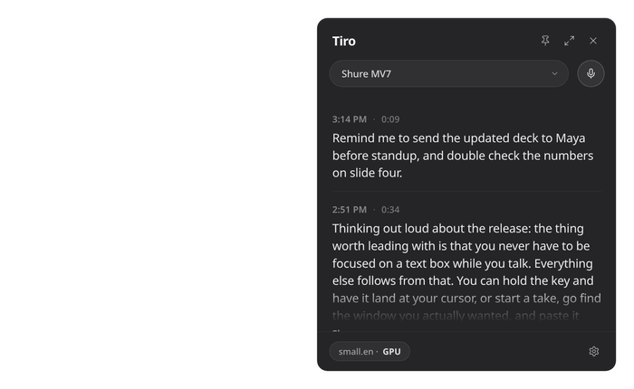
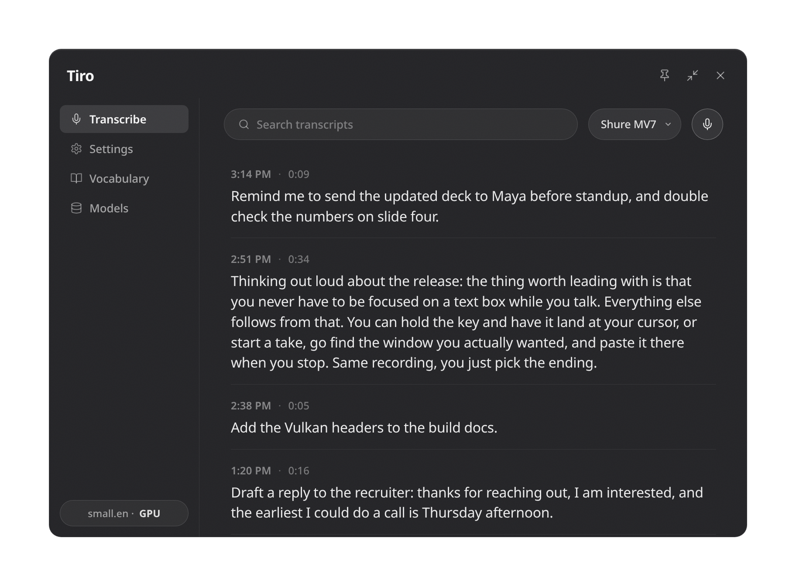
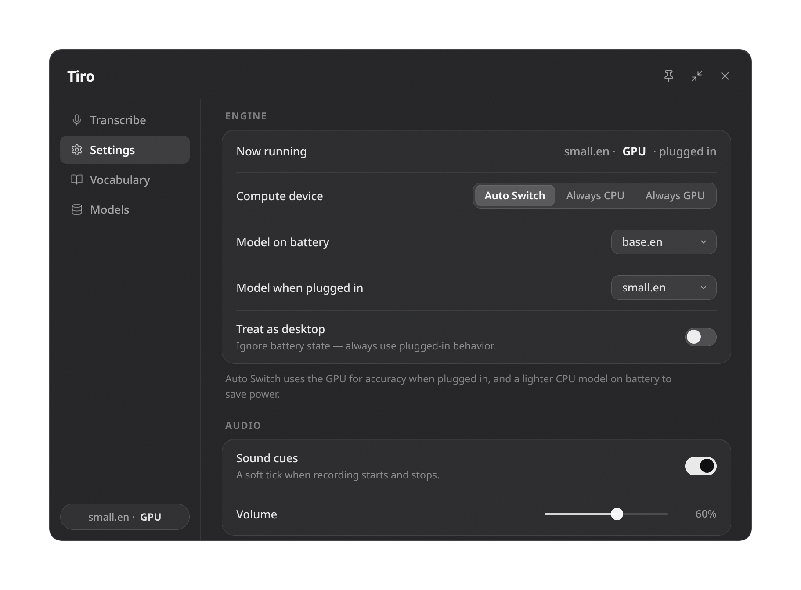
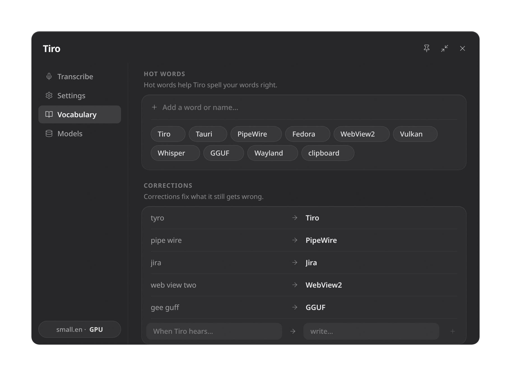
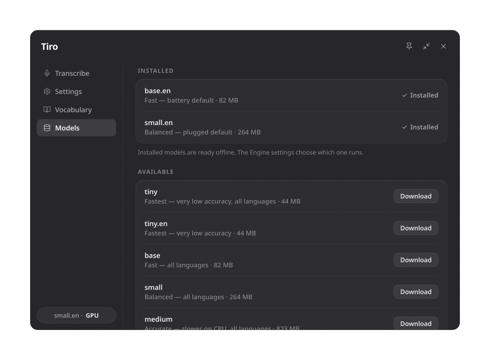

<div align="center">

# Tiro

[](LICENSE)    

*Offline, on device transcription tool. Turns out you never had to send your voice to a tech bro in Silicon Valley to get a decent transcript.*




**Press a hotkey, talk, press it again.**<br>
Your words land on the clipboard, or at your cursor. Nothing ever leaves your computer.

</div>

> [!IMPORTANT]
> **Work in progress.** I use this every day on Linux and Windows for my real work and it's stable for me, but it isn't complete yet, and I'm still changing things. Consider this application in development beta and not a polished final product.

## Why I made this

Every dictation tool I tried types into whatever box you're focused on. Click somewhere else and it stops, or it dumps half a sentence into the wrong window. I talk while I'm doing other stuff, clicking around, reviewing recent work, switching apps, and I don't want the app fighting me for the cursor.

So Tiro splits the talking from the delivery. It records, transcribes locally with whisper.cpp, and you pick where the text goes.

|  |  |
|---|---|
| **Quick transcribe** | Hold `Ctrl+Alt+V`, say something, let go. It lands at your cursor. |
| **Toggle dictation, then paste it** | Tap `Ctrl+Alt+Space`, talk as long as you want, click around, find the window you actually wanted, and finish on `Ctrl+Alt+V`. |
| **Just copy it** | Stop with `Ctrl+Alt+Space` and the output is stored in the clipboard and in the Tiro panel. |

The key you *finish* on decides. Everything reaches the clipboard either way, so pasting is an extra on top, never a replacement.

## Hotkeys

| Key | Action |
|---|---|
| `Ctrl+Alt+Space` | Dictate. Tap to toggle, hold for push-to-talk. |
| `Ctrl+Alt+V` | Same, and it pastes at your cursor. |
| `Ctrl+Alt+C` | Show / hide the panel. |
| `Ctrl+Alt+X` | Throw away the recording. |

All four are rebindable.

## The panel

`Ctrl+Alt+C` puts a panel over whatever you're doing: a mic picker, a record button, and recent transcriptions. Click any line to copy it again. Expand the panel for more controls and settings.

|  |  |
|---|---|
|  |  |
| **Transcribe.** Search back through everything you've dictated. Opens on today and streams older days in as you scroll. | **Settings.** Engine, audio, capture, input, shortcuts, storage, appearance, login. |
|  |  |
| **Vocabulary.** Hot words prime Whisper so it spells your names right. Corrections fix what it still misses, and only touch the copy you paste. | **Models.** Manage the transcription models installed on device, tiny through large-v3-turbo from Hugging Face. |

There's a tray icon too: left click toggles the panel, right click gives you Open, Start/Stop, Restart, Quit. On a Mac it lives in the menu bar.

## Engine, GPU, laptop power savings

Tiro works out what machine it's on at startup and shows only the settings that apply.

| Machine | What you get |
|---|---|
| Laptop, discrete GPU | Auto Switch: GPU and the bigger model plugged in, CPU and the lighter one on battery |
| Laptop, integrated or Apple Silicon | Stays on the GPU, just swaps the model |
| Desktop | One compute row, one model, no battery settings |
| No usable GPU | None of it shows up |

The same install should do the right thing on every kind of machine without you configuring it. A desktop just uses the GPU and never thinks about batteries, because it doesn't have one. A laptop shouldn't burn power on the discrete card to transcribe one sentence, so on battery it drops to the CPU and a lighter model, and every bit of GPU work lives in a child process that exits when it's done, because a GPU context held open inside a long lived app keeps that card awake and costs you watts all day. A machine with no usable GPU shouldn't be shown settings about one at all.

## Nothing gets lost

Every take is written verbatim to one JSONL and one Markdown file per day. Clipboard cleanup and corrections change only the copy you paste, never the log. If that folder isn't writable, Tiro falls back to its own folder and says so in the panel.

The one time it touches the network is downloading a model, and only when you ask. No accounts, no telemetry.

## Install

Three ways in: grab an installer (recommended), paste a prompt at an agent, or build it yourself. They all end up in the same place.

### Installers

Official releases are available on the [Releases page](https://github.com/beckettharriman/tiro/releases). Tiro is two programs, the app and a worker beside it that does the GPU work. If your machine has a Vulkan driver the worker uses it, and if it doesn't you get the CPU and nothing breaks.

| | Get | Then |
|---|---|---|
| **Windows** | The setup `.exe`. The `.msi` does the same thing machine-wide. | Run it. Windows will say the publisher is unknown, because I haven't bought a certificate. More info, Run anyway. |
| **Linux** | `.deb` on Debian and Ubuntu, `.rpm` on Fedora, the AppImage anywhere. | `sudo apt install ./tiro_*.deb`, or `sudo dnf install ./tiro-*.rpm`. For the AppImage, make it executable and run it. |
| **macOS** | The `.dmg`, or build one yourself with `npm run package:mac`. | Drag Tiro into Applications. Allow the microphone when asked, and Accessibility if you want paste at cursor. [MACOS.md](MACOS.md) has the details. |

Tiro starts hidden with a tray icon, and an installed copy switches itself on at login so it's there next boot. Both are in Settings if you'd rather not. `Ctrl+Alt+C` opens the panel, and the first dictation downloads a model, about 80 MB.

Nothing is tagged yet, so that page is empty until the first release.

### Let an agent do it

Paste this at your terminal agent:

```text
Set up Tiro on my machine.

Read https://raw.githubusercontent.com/beckettharriman/tiro/main/SETUP.md and
follow it end to end for my OS. That file is maintained in this repo and is the
source of truth, so trust it over anything you already know about the project.
If you can't fetch it, clone https://github.com/beckettharriman/tiro and read
SETUP.md out of the checkout.

Ask me before anything that needs sudo or changes system settings. When you're
done, run the verification checklist at the end and tell me which keys to press.
```

### From source

The full version, with per-distro package lines and troubleshooting, is [SETUP.md](SETUP.md). It lives in the repo, so it changes in the same commit the build does and neither path goes stale. The short version:

**1. Prerequisites.** Rust, CMake, and a C/C++ toolchain everywhere. On Linux, also your distro's WebKitGTK 4.1, GTK 3, appindicator, librsvg, ALSA and libxdo dev packages. On Windows, VS 2022 with the C++ workload, a real Windows CMake, LLVM for `libclang.dll`, and the WebView2 runtime. On macOS, the Xcode command line tools. Exact package lines per distro are in [SETUP.md](SETUP.md#1-prerequisites).

**2. Clone and build.** The GPU worker needs the [Vulkan SDK](https://vulkan.lunarg.com/) to build. If you don't have it, skip that line and you get the CPU; add it later without losing anything. On a Mac, build everything with `--features metal` instead, which needs no SDK.

```sh
git clone https://github.com/beckettharriman/tiro.git
cd tiro/src-tauri
cargo build --release                                        # the app
cargo build --release --bin tiro-gpu-worker --features gpu   # the GPU worker
```

**3. Run it.**

```sh
./target/release/tiro
```

A source build keeps `config.ini` and its models next to the app, in `src-tauri/`. An installer keeps them in a per-user folder instead. Keep the two binaries together, since the app looks for the worker next to itself.

**4. Wayland only.** Install the desktop file so the shortcuts portal can identify Tiro, then restart it. The `.deb` and `.rpm` already did this for you; for an AppImage, symlink the AppImage itself in the second line.

```sh
cp src-tauri/linux/dev.tiro.app.desktop ~/.local/share/applications/
ln -s "$PWD/src-tauri/target/release/tiro" ~/.local/bin/tiro
```

**5. Check it.** Press `Ctrl+Alt+Space`, say a sentence, press it again. The text should appear in the panel and paste out of your clipboard.

Anything that goes wrong is probably in [SETUP.md](SETUP.md#troubleshooting).

<details>
<summary><b>Linux hotkeys, X11 and Wayland</b></summary>

X11 hotkeys are normal keyboard grabs. Wayland doesn't allow those, so Tiro binds through the `GlobalShortcuts` portal, which works on KDE and GNOME once the desktop file above is installed. Paste at cursor goes through the remote desktop portal, so the first one asks permission.

If your compositor has no portal backend, bind desktop shortcuts to the CLI instead, since a second launch remote controls the running one:

```
tiro --toggle   # start / stop dictating
tiro --paste    # paste the take at the cursor
tiro --panel    # show / hide the panel
tiro --cancel   # throw away the recording
```

</details>

## Status

Working on Linux, Windows and macOS: dictation, paste at cursor, hotkeys, the panel, the engine and GPU policy, models, vocabulary, transcripts, tray, autostart. Linux and Windows are what I use every day. The macOS port is Trevor Buettgen's work and I don't run it myself, so it gets less of my attention than the other two.

Installers are built for every tagged release. There hasn't been a tagged release yet.

## The name

[Marcus Tullius Tiro](https://en.wikipedia.org/wiki/Marcus_Tullius_Tiro) was Cicero's secretary. He invented a shorthand system so he could write speech down as fast as people talked, which makes him more or less the first dictation software. Two thousand years later, here we are.

## License

[GPLv3](LICENSE) © Beckett Harriman.
